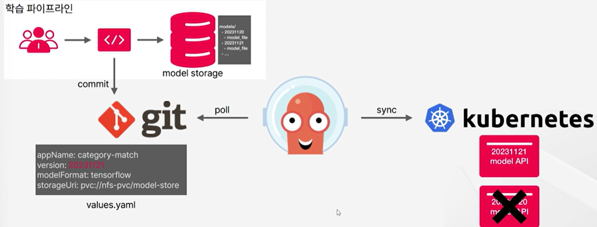
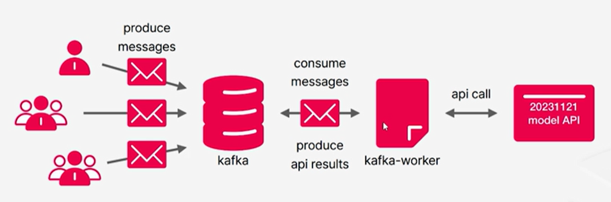

# 1. [Environment Setup] Real-time Product Category Classification

Setting up an environment for real-time product category classification.

## Project Background for using MLOps

1. **Continuous influx of product data**: To handle all in real-time demands substantial GPU utilization.
2. **GPU costs**: GPU occupancy be minimized during low traffic + enabling near real-time processing?
3. **Unified Platform** for deployment of models from ML researchers using PyTorch and TensorFlow.
4. **Model management**: Includes model storage, versioning of deployed models, and deployment history.
5. **Failure management**: Automating model deployment to prevent human errors, streamlining deployment processes, and addressing failures in model APIs.

## Tools

1. Google Kubernetes Engne(GKE) & Kubernetes
    - Also uses cloud disk of 10GB
2. KServe: Model inference platform on top of k8s
    - supports:
        - standard API for diffent ML protols
        - efficient resource management using autoscaling (enables autoscaling to 0)
    - Installation: [KServe Installation Page](https://kserve.github.io/website/master/admin/serverless/serverless/#1-install-knative-serving)
3. Knative 
    - supports:
        - platform for serverless application deployment & management
        - autoscaling based on the traffic (-> 0)
        - Optimizing resource cost
    - Installation: [Knative Installation](https://knative.dev/docs/install/)
4. Istio: Platform for service mesh
    - supports:
        - network connection management for each app in microservice distributed environment
        - provides stable service and traffic management
    - Installation: [Installing Istio for Knative](https://knative.dev/docs/install/installing-istio/#using-istio-mtls-feature-with-knative), [Istioctl](https://istio.io/latest/docs/setup/install/istioctl/)
5. Cert-manager: cert. management for HTTP communication
    - Installation: [cert-manager installation](https://cert-manager.io/docs/installation/)
6. GitOps
7. ArgoCD
    - Installation: [ArgoCD: Getting Started](https://argo-cd.readthedocs.io/en/stable/getting_started/)
8. Helm
9. Kafka: Distributed Streaming Platform
    - supports:
        - High performance event streaming platform
        - manages all events/data flows
        - uses message queue in pub-sub model
            - asynch. communication
            - scalable architecture
    - Installation: using kafka on k8s
        ```bash
        $ kubectl apply -f zookeeper.yaml
        $ kubectl apply -f kafka.yaml
        ```
    - Environment setup
        - topic creation
            1. access kafka pod
                ```bash
                $ kubectl get pod
                $ kubectl exec -it pod/{kafka-pod} -- /bin/bash
                ```
            2. create topic
                ```bash
                $$ kafka-topics --create --bootstrap-server localhost:29092 --replication-factor=1 --partitions=1 --topic=category-match-in
                $$ kafka-topics --create --bootstrap-server localhost:29092 --replication-factor=1 --partitions=1 --topic=category-match-out
                ```
        - Test
            ```bash
            cd test-kafka
            kubectl apply -f pod.yaml
            kubectl exec -it pod/test-pod -- /bin/bash
            apt-get update
            apt-get install -y vim
            vi main.py
            pip install confluent-kafka
            python main.py
            ```

## Dataset

- Using "[상품 이미지](https://www.aihub.or.kr/aihubdata/data/view.do?currMenu=115&topMenu=100&aihubDataSe=data&dataSetSn=64)"(Product Image) data
    - Use "Sample data"(536 MB)

## Model Serving Pipeline 


- Model storage
    - Save trained artifacts **automatically** using model storage
        - trained model
        - tokenizer json
    - Create directories for each version
    - Read from # of pods
- GitOps
    - Separate Dev/Ops values files
    - Private Repository: save `git  token secret` in k8s cluster
        - use argoCD
    - check api version of the current model using git
- ModelAPI
    - resource moniotoring(check GPU utilization)
    - config. # of pods to process the request throughput/s
    - efficiently use resources and remove any obstacles for usign auto scaling 
        - if setting min replica to 0, failures may occur occasionally

## Model Inference Pipeline



- Kafka-worker
    - consume
        - config `consume config`
        - consume topic subscribe
        - message polling
    - process
        - message parsing
        - model api call
            - preprocessing using tokenizer
            - generate model api input
            - model api request
            - parsing model api response
            - generate label value
            - generate message
    - produce
        - config `produce config`
        - produce message to topic

## Inference Pipeline Operation

- Kafka
    - decide message spec.
    - increase consume topic partition for throughput
        - #. partition == #. workers
    - Security SASL config
- Kafka worker
    - requested throughput
        - asynch request handling
    - set timeout based on the speed of model inference
    - use trained model artifacts(tokenizer)