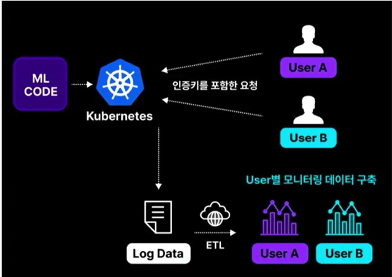
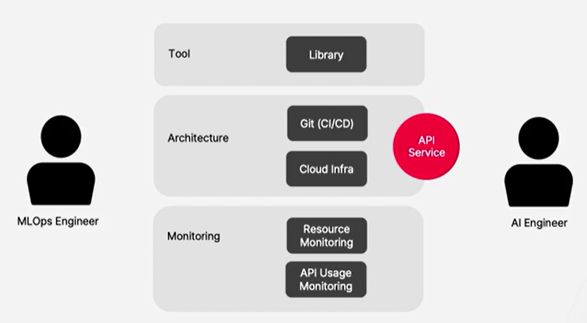
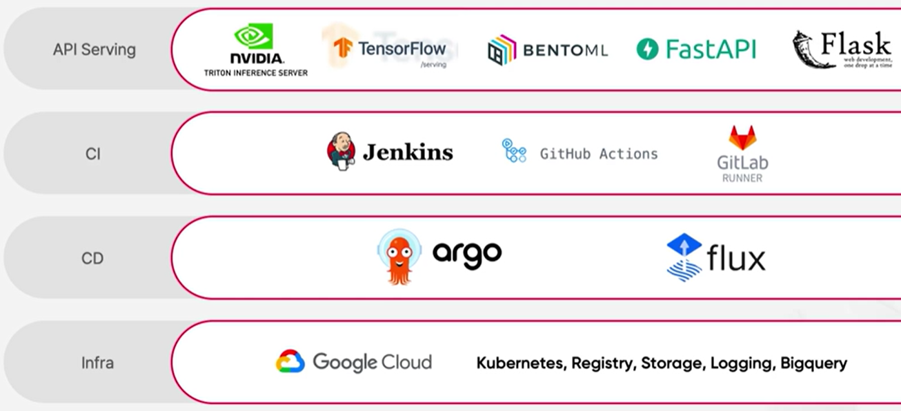

# [Monitoring Pipeline] NLP Model Serving for Efficient E-commerce Operation

## Goal

1. Real-time API serving for NLP models
2. Build Auth. based resource monitoring pipeline

- (Uses cloud & k8s environment)

## Project Outline

1. Write AI API Service
2. Model management based on cloud storage
3. Setup GCP k8s infrastructure
4. Deploy CI/CD 
5. API Authentication using Nginx Ingress 
6. API resource monitoring using logs (ETL Pipeline)

## Project Materials

### Model & Dataset

- Dataset: [News Summary](https://www.kaggle.com/datasets/sunnysai12345/news-summary)
- NLP Model: [Training T5 Models made easy with simpleT5](https://www.kaggle.com/code/nulldata/training-t5-models-made-easy-with-simplet5/notebook)

### Tools and Infra.

- Architecture overview
    - 
- Tools
    - 

## Instructions

1. Create AI API Service
    - setup to load model
    - create `POST` request to handle request
2. Create a GCS client library
    - setup Google cloud environment
    - create a gcp client library
3. Implement model upload
4. Implement model download

### Resources

#### FastAPI

- [Installation](https://fastapi.tiangolo.com/tutorial/)
- [Sample Code](https://fastapi.tiangolo.com/tutorial/first-steps/)
- [Lifespan](https://fastapi.tiangolo.com/advanced/events/?h=lifespan#lifespan)
- [BaseModel](https://fastapi.tiangolo.com/tutorial/body/?h=basemodel#import-pydantics-basemodel)
- [API in Container](https://fastapi.tiangolo.com/de/deployment/docker/?h=docker)

- tips:
    - must use `protobuf` version 3.20.x or lower

#### Google Cloud

- Steps
    1. Setup a project
    2. Create a bucket
    3. Create a service account & key
    4. Grant permission to access the bucket
        - Set to "Stoarge Admin"

- client
    - [Python Client for GCS](https://cloud.google.com/python/docs/reference/storage/latest)
